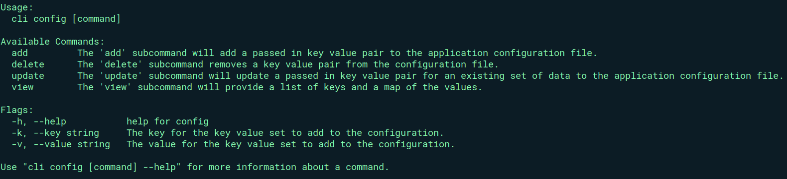
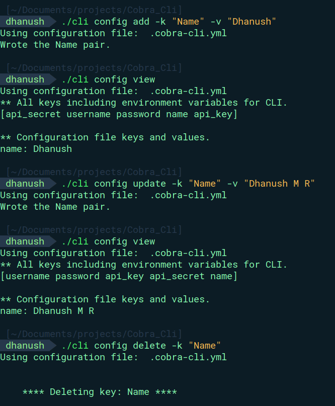

<h1 align="center">Cobra cli</h1>
<br/>

_This is a CLI App Name is a command-line application built with Go, utilizing the [Cobra](https://github.com/spf13/cobra) and [Viper](https://github.com/spf13/viper) libraries for efficient command-line handling and configuration managementr._

##Build
```bash
cd CLI

#build executable
go build .
```

## Using The CLI
```bash ./cli config -h ``` provides the following documentation for using this CLI .
```bash
Available Commands:
  add         The 'add' subcommand will add a passed in key value pair to the application configuration file.
  delete      The 'delete' subcommand removes a key value pair from the configuration file. 
  update      The 'update' subcommand will update a passed in key value pair for an existing set of data to the application configuration file.
  view        The 'view' subcommand will provide a list of keys and a map of the values.

Flags:
  -h, --help           help for config
  -k, --key string     The key for the key value set to add to the configuration.
  -v, --value string   The value for the key value set to add to the configuration.
```

## CRUD COMMANDS
Writes a record to the configuration file
```bash
./cli config add -k "key" -v "value"
```
Displays the contents of the configuration file and CLI specific environment variables
```bash
./cli config view
```
Update the contents of the configuration file
```bash
./cli config update -k "key" -v "value"
```
Delete a Key value from the configuration file
```bash
./cli config delete -k "key" -v "value"
```

Replace "key" and "value" with your actual key value.

## Example
<p align="center"> Documentation</p>
<br/>
<p align="center"> </p>
Example Of CRUD Commands
